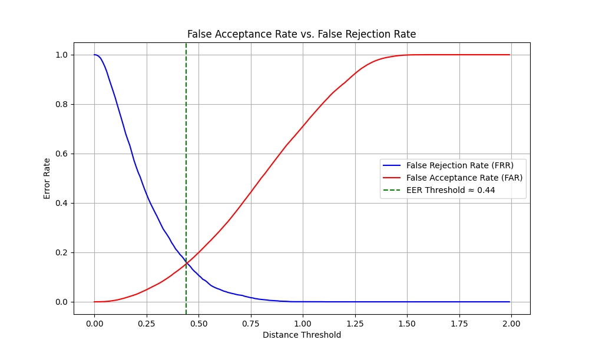

# Cryptographic Key Generation Using Biometrics

This project demonstrates a system that generates a 128-bit cryptographic key from a users keyboard and mouse (KMT) dynamics. It uses a Siamese Neural Network to create a unique biometric template, which is then used to reproduce a stable key.

## Results

The system was trained and evaluated on a public dataset of 88 users, achieving an **Equal Error Rate (EER) of approximately 15%**.

## How to Run

1.  **Clone the repository.**
2.  **Set up a Python virtual environment.**
3.  **Install dependencies:** `pip install -r requirements.txt`
4.  **Download the dataset** and place it in the appropriate folder as described in the code.
5.  **Run the main script:** `python3 src/main.py`

*Note: The first run will train the model and may take several minutes. Subsequent runs will load the saved model instantly.*
